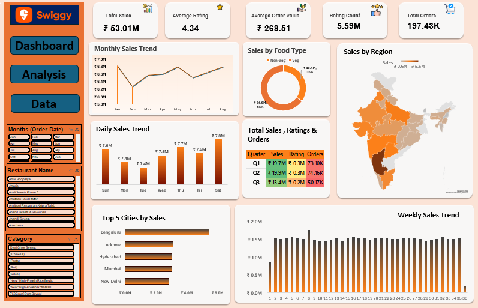

# 🍽️ Swiggy Sales Dashboard

## 📊 Project Overview

This project presents an interactive **Swiggy Sales Dashboard built using Microsoft Excel** to analyze sales performance, customer ratings, order volume, food-type preferences, regional performance, and sales trends.

The dashboard transforms raw sales data into meaningful business insights through interactive filters, KPIs, charts, and visual analysis.

## 🎯 Objectives

* Analyze overall sales and order performance
* Identify sales trends across months and days
* Compare Veg and Non-Veg sales
* Analyze regional and city-wise performance
* Understand quarterly sales, ratings, and order trends
* Identify top-performing cities

## 🛠️ Tools & Technologies

* **Microsoft Excel**
* Pivot Tables
* Pivot Charts
* Slicers
* Excel formulas
* Data Analysis & Visualization

## 📈 Dashboard Preview

## 📌 Key KPIs

| KPI                 |   Value |
| ------------------- | ------: |
| Total Sales         | ₹53.01M |
| Total Orders        | 197.43K |
| Average Order Value | ₹268.51 |
| Average Rating      |    4.34 |
| Rating Count        |   5.59M |

## 🔍 Key Insights

* Total sales reached **₹53.01M** across approximately **197.43K orders**.
* The average order value was **₹268.51**, indicating the average revenue generated per order.
* **Veg food contributed approximately 65% of total sales**, while Non-Veg contributed around 35%.
* **Q2 recorded the highest quarterly sales**, with approximately ₹19.9M in sales.
* **Bengaluru emerged as the top-performing city by sales** among the cities shown in the dashboard.
* The monthly sales trend shows fluctuations throughout the period, with sales reaching around ₹7M in the stronger months.
* The dashboard provides both daily and weekly sales trends to understand changes in sales performance over time.

## 📁 Project Files

* `Swiggy-Sales-Dashboard.xlsx` — Complete Excel workbook containing the Data, Analysis, and Dashboard sheets.
* `Swiggy Raw Data Excel.xlsx` — Raw dataset used for the analysis.
* `swiggy-dashboard-preview.png` — Dashboard preview image.

## 💡 Business Value

This dashboard demonstrates how raw sales data can be transformed into an interactive reporting solution that helps identify **sales trends, high-performing locations, customer preferences, and overall business performance**.

## 🚀 Conclusion

The project provided hands-on experience in data cleaning, analysis, visualization, dashboard development, and extracting actionable insights from a real-world-style sales dataset.

This is one of my projects as I continue building my **Data Analytics portfolio**.
